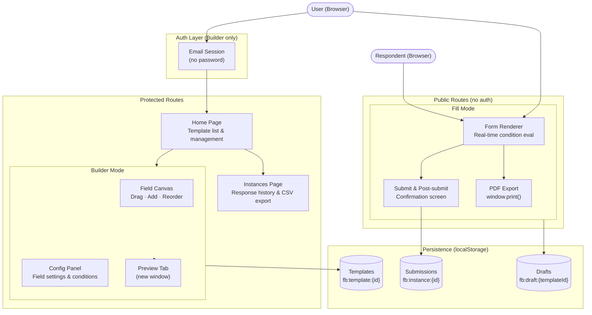
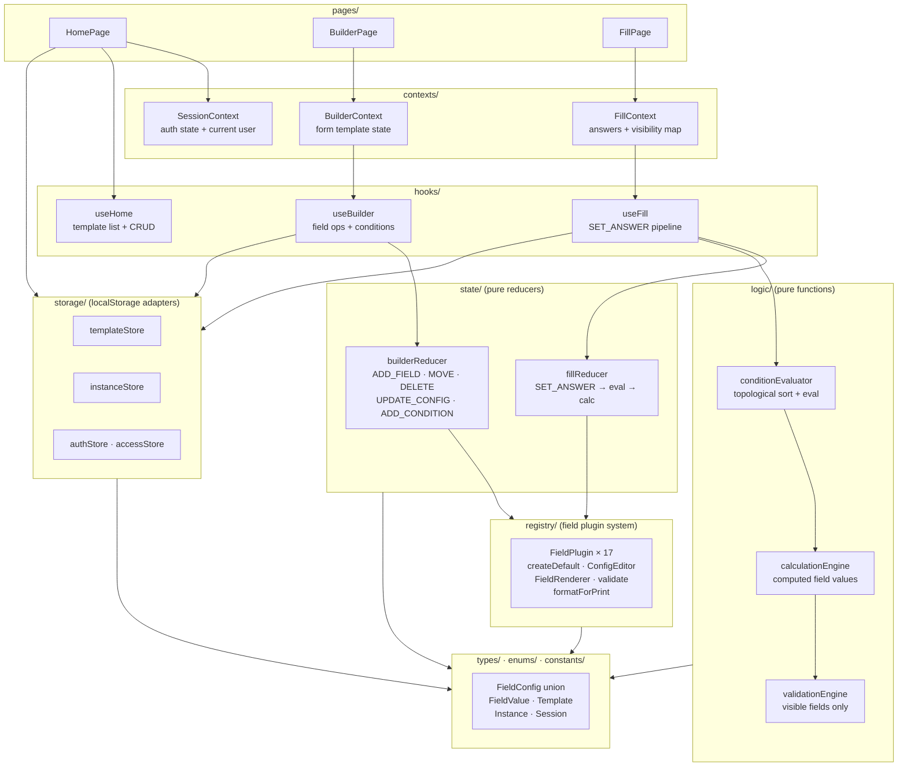
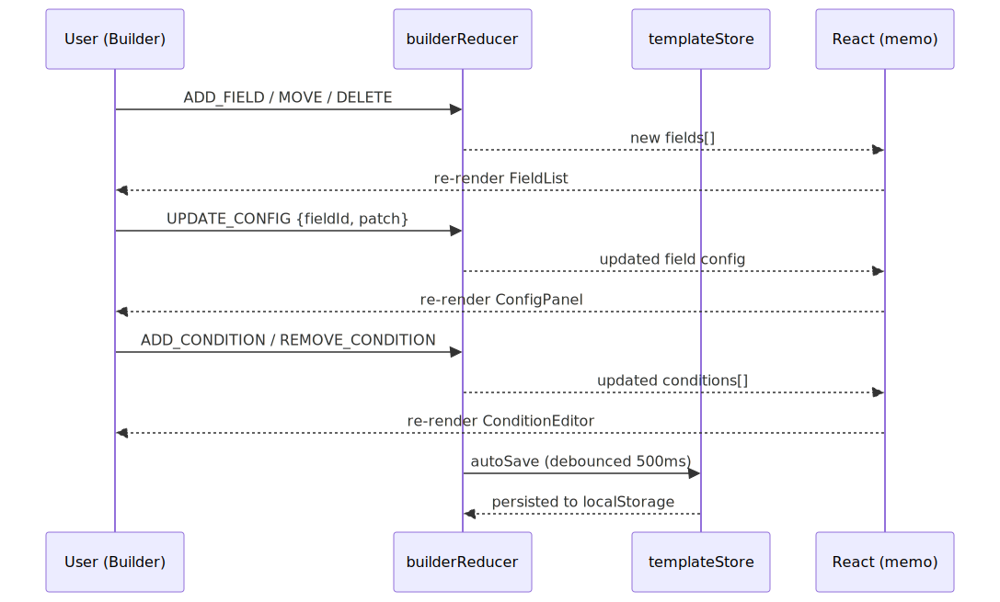
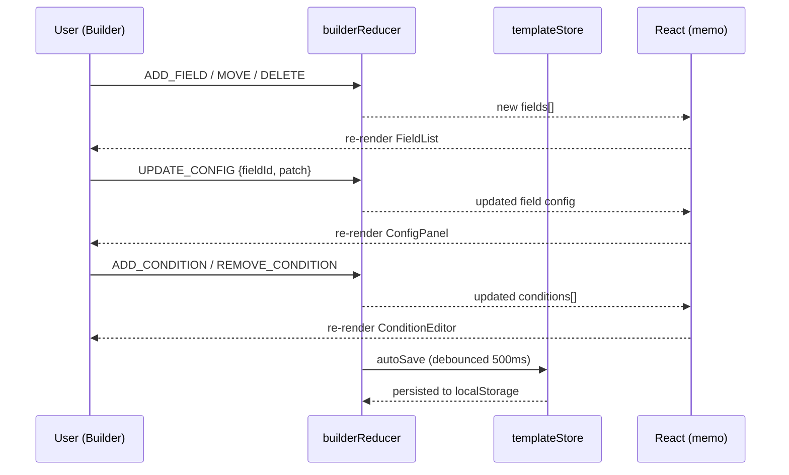
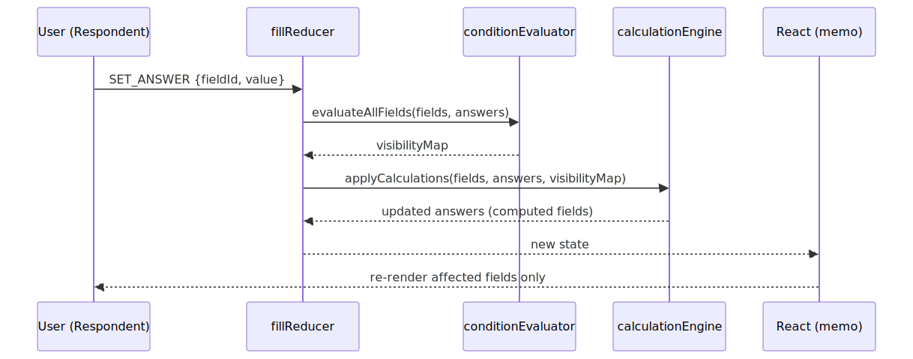
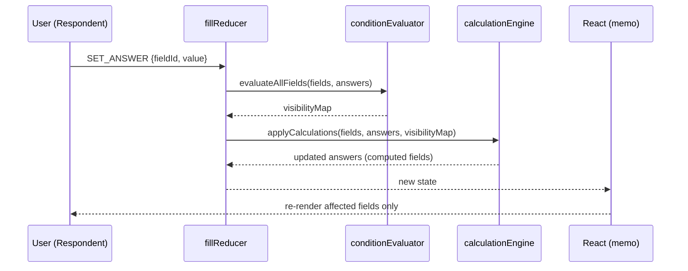

# Architecture Diagrams

---

## High-Level Design

System-level view — user journeys, major subsystems, and persistence.

---

## Low-Level Design

Module-level data flow — how a user action propagates through the layers.

---

## Sequence Diagrams

### Builder Mode — field edit pipeline

User actions in the builder propagate through `builderReducer`, trigger a React re-render of the affected panel, then auto-save (debounced 500 ms) to `localStorage`.

### Fill Mode — SET_ANSWER pipeline

Every keystroke / field change runs the full condition + calculation pipeline before React re-renders only the affected fields.

